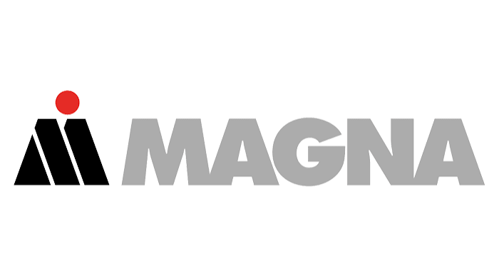

# Welcome to the Robotics and Fault Prediction workshop!

Modern manufacturing relies on hundreds of highly reliable machines working together to maintain efficiency and productivity. However, even with advanced equipment, unexpected machine downtime continues to cost industries millions of dollars each year in lost output, delayed operations, and increased maintenance expenses.

Across this hands-on 3-day workshop, you will tackle real problems from the manufacturing and automotive sectors by learning how to build and train machine learning models that detect and predict motor failures before they happen.

### Event Details & Schedule

- Dates: October 5th – October 7th
- Time: 17:30 – 19:30 EDT each day
- Location: Ideas Clinic, PSE - 1427

### 3-Day Breakdown:

#### Day 1: **LEARN**

- Industrial applications of fault prediction
- Introduction to Machine Learning

#### Day 2: **BUILD**

- Build a data collection apparatus
- Collect sensor data and train your predictive model

#### Day 3: **COMPETE**

- Tune and optimize your model
- Compete against other teams for the most accurate model!

